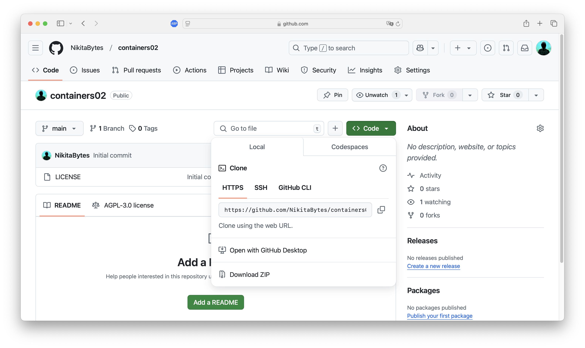

# Лабораторная работа №3: Основы контейнеризации

---

## Студент

- **Имя и фамилия**: Никита Савка  
- **Группа**: I2302  
- **Платформа**: macOS (Apple M3)  
- **Дата выполнения**: 25 февраля 2025  

---

## Цели и задачи

Целью лабораторной работы является освоение базовых принципов контейнеризации с использованием Docker. Основные задачи:

1. Установить Docker Desktop и проверить его работоспособность.  
2. Создать репозиторий и подготовить базовые файлы для контейнеризации.  
3. Собрать Docker-образ из созданного `Dockerfile`.  
4. Запустить контейнер и протестировать его работу.  
5. Составить `README.md` с описанием процесса и выводами.  

---

## Ход выполнения

### 1. Установка Docker Desktop

#### Шаги:
1. **Скачивание**:  
   - Перешёл на [официальный сайт Docker](https://www.docker.com/products/docker-desktop).  
   - Загрузил версию для macOS (Apple M3).  
   - Установил через перетаскивание в папку `Applications`.  

2. **Запуск**:  
   - Открыл Docker Desktop через Spotlight.  
   - Дождался полной инициализации (значок в меню стал статичным).  

3. **Проверка**:  
   - В терминале выполнил:  
     ```bash
     docker --version
     ```
   - Результат:  
     ```
     Docker version 27.5.1, build 9f9e405801
     ```

#### Итог:
Docker успешно установлен и готов к работе.  

**Скриншот**: Терминал с выводом `docker --version`  


---

### 2. Подготовка репозитория

#### Шаги:
1. **Создание на GitHub**:  
   - Создал репозиторий `containers02` в своём профиле GitHub.  

2. **Клонирование**:  
   - Выполнил в терминале:  
     ```bash
     git clone https://github.com/NikitaBytes/containers02.git
     cd containers02
     ```

#### Итог:
Локальная копия репозитория готова для работы.  

**Скриншот**: Репозиторий на GitHub  



---

### 3. Создание `Dockerfile`

#### Шаги:
1. **Создание файла**:  
   - В папке проекта:  
     ```bash
     touch Dockerfile
     ```

2. **Наполнение**:  
   - Открыл файл в редакторе (например, `nano Dockerfile`) и добавил:  
     ```dockerfile
     FROM debian:latest
     COPY ./site/ /var/www/html/
     CMD ["sh", "-c", "echo hello from $HOSTNAME"]
     ```

#### Итог:
`Dockerfile` готов к сборке образа.  

**Скриншот**: Содержимое `Dockerfile`  


---

### 4. Создание веб-страницы

#### Шаги:
1. **Создание структуры**:  
   - Выполнил:  
     ```bash
     mkdir site
     touch site/index.html
     ```

2. **Редактирование `index.html`**:  
   - Открыл файл (`nano site/index.html`) и добавил:  
     ```html
     <!DOCTYPE html>
     <html lang="en">
     <head>
         <meta charset="UTF-8">
         <meta name="viewport" content="width=device-width, initial-scale=1.0">
         <title>My Docker Page</title>
     </head>
     <body>
         <h1>Hello from Docker!</h1>
     </body>
     </html>
     ```

#### Итог:
Простая HTML-страница готова для копирования в контейнер.  

**Скриншот**: Создание директорий и файлов. Содержимое `index.html`  


---

### 5. Сборка Docker-образа

#### Шаги:
1. **Команда сборки**:  
   - В папке `containers02`:  
     ```bash
     docker build -t containers02 .
     ```

2. **Процесс**:  
   - Docker загрузил образ `debian:latest`.  
   - Скопировал содержимое папки `site` в `/var/www/html/`.  
   - Завершил сборку с выводом:  


3. **Время**:  
   - Сборка заняла ~13.9 секунд.  

#### Итог:
Образ `containers02` успешно создан.  

---

### 6. Запуск контейнера

#### Шаги:
1. **Запуск**:  
   - Выполнил:  
     ```bash
     docker run --name containers02 containers02
     ```
   - Вывод:  
     ```
     hello from f8caf8c06377
     ```

#### Итог:
Контейнер вывел сообщение и завершил работу.  

**Скриншот**: Вывод запуска  


---

### 7. Интерактивный режим

#### Шаги:
1. **Очистка**:  
   - Удалил старый контейнер:  
     ```bash
     docker stop containers02
     docker rm containers02
     ```

2. **Запуск с терминалом**:  
   - Выполнил:  
     ```bash
     docker run -ti --name containers02 containers02 bash
     ```

**Скриншот**: Скриншот ввода в терминал всех команд.  


3. **Проверка**:  
   - Внутри контейнера:  
     ```bash
     cd /var/www/html/
     ls -l
     ```
   - Вывод:  
     ```
     -rw-r--r-- 1 root root 239 Feb 25 10:00 index.html
     ```

4. **Выход**:  
   - Ввел `exit` для остановки контейнера.  

#### Итог:
Убедился, что файлы скопированы корректно.  

**Скриншот**: Вывод всех команд и `ls -l`  


---

### 8. Создание `README.md`

#### Шаги:
1. **Создание**:  
   - Выполнил:  
     ```bash
     touch README.md
     ```

2. **Наполнение**:  
   - Добавил описание проекта, шаги выполнения, выводы и вопросы.  

#### Итог:
Файл `README.md` готов для документирования работы.  

**Скриншот**: Редактирование `README.md`  


---

## Выводы

1. Docker успешно установлен и протестирован на macOS (M3).  
2. Создан и запущен контейнер на базе `debian:latest` с файлом `index.html`.  
3. Файлы корректно копируются в `/var/www/html/`.  
4. Интерактивный режим подтвердил работоспособность окружения.  
5. Подготовлена база для будущих экспериментов с контейнерами.  

---

## Вопросы и ответы

1. **Сколько времени заняла сборка образа?**  
   - Примерно 13.9 секунд (зависит от сети и оборудования).  

2. **Что выводит контейнер без `-ti`?**  
   - `hello from <container_id>` с последующим завершением.  

3. **Где находится `index.html` в контейнере?**  
   - В `/var/www/html/index.html`.  

4. **Зачем удалять старые контейнеры?**  
   - Для экономии места и избежания конфликтов именования.  

---

## Источники

1. [Официальная документация Docker](https://docs.docker.com/)  
2. [Docker Desktop для Mac (Apple Silicon)](https://docs.docker.com/desktop/mac/apple-silicon/)  
3. [GitHub Docs](https://docs.github.com/)  
4. [Руководство по Markdown](https://www.markdownguide.org/)  

---
